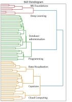

# Aspiring Data Professional

##### Technical Skills: Python, SQL, Microsoft Azure, Databricks, Excel, MATLAB, C++ 

### Education
- MEng, Analytics, Financial Engineering Certificate   | *Univeristy of Toronto* (Nov 2023)
- BASc, Mechanical Engineering                         | *Univeristy of Toronto* (June 2017)

### Projects

#### Multi Stock Return Forecasting
  
[Repository](https://github.com/eydeyoung/Multistock_Predictive_Analytics)  

Cleaned and merged stock price data with ticker data and currency data. Developed machine learning models predicting weekly stock returns of MMM and GE stock using python's scikit learn library with features generated with TA-lib. This led to findings that daisy-chained time series models were not as effective as sequential models in predicting weekly stock returns. Statistical analysis was performed using AlphaLens to evaluate the efficacy of the predictions as factors in a trading strategy. 

#### Salary Level Analysis in the Data Science Community
  
[Repository](https://github.com/eydeyoung/salary-comparison)  

Performed statistical analysis of salary levels in the Kaggle data science community evaluating the impact of factors including gender, education, and country, using bootstrapping and hypothesis testing, as well as machine learning methods. Verified the significance of the gender salary gap and developed an ordinal logistic classifier in scikit-learn API in order to predict salary levels with unique factor combinations.

#### AI Motivated Curriculum Development
  
[Repository]((https://github.com/eydeyoung/AI_Motivated_Curriculum_Development))  

Webscrapped job postings and generated skills using chatGPT in order to cluster skills to generate a career curriculum that is more relevant to current job openings.

